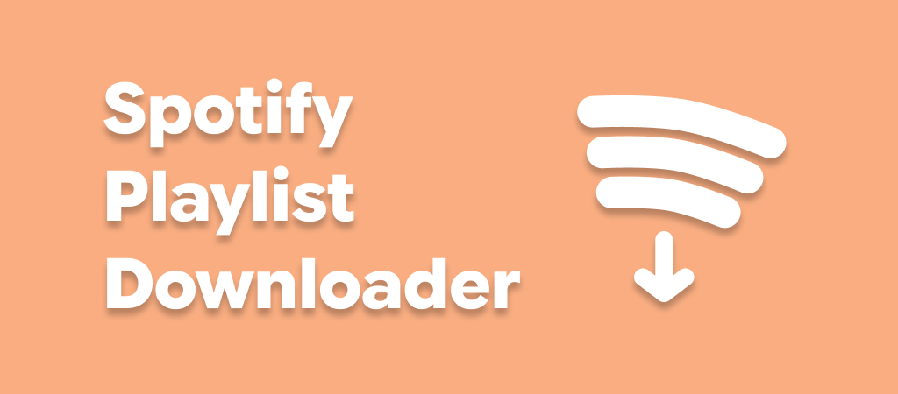

  

<h1 align="center">Spotify Playlist Downloader</h1>

  
  
  

  <strong>An intuitive, feature-rich Android application that downloads Spotify playlists directly to your device storage.</strong> 
  Scrape track metadata from Spotify, source high-quality audio streams from YouTube Music, and save fully-tagged audio files with high-res cover art.

---

## ✨ Features

- 🎵 **Direct Spotify Scraping**: Scrapes playlist metadata directly without requiring Spotify API keys or user account login.
- 📲 **Seamless Spotify Integration**: Supports receiving Spotify playlist links shared directly from the Spotify app via Android's share menu.
- 🎧 **YouTube Music Audio Sourcing**: Uses [NewPipe Extractor](https://github.com/TeamNewPipe/NewPipeExtractor) to match tracks with the highest quality YouTube Music streams.
- 🏷️ **Embedded Metadata & High-Res Cover Art**: Automatically embeds Title, Artist, Album metadata, and high-resolution cover art into every audio file.
- ⚡ **FFmpeg Tagging & Optional MP3 Conversion**: Powered by FFmpeg Kit for fast audio remuxing, metadata tagging, and optional conversion from M4A to MP3.
- 📂 **Storage Access Framework (SAF)**: Select any custom directory on your device storage to save your downloaded tracks.
- 🔄 **Queue Management & Selective Retry**: View real-time download progress for each track, cancel active downloads/scraping, and easily retry failed downloads.
- 🔔 **Background Download Service**: Downloads run reliably in a foreground service with live progress updates in the notification bar.
- 🚀 **In-App Auto-Updates**: Integrated update checker automatically notifies you when a new version is available on GitHub.
- 🎨 **Modern Material 3 Design**: Built with Jetpack Compose featuring smooth animations, light/dark themes, and clean navigation.

---

## 🚀 How It Works

1. **Share or Paste Link**: Paste a public Spotify playlist URL or share it directly from the Spotify app.
2. **Scrape Metadata**: The app fetches playlist details, track listings, and album art directly.
3. **Stream Match**: Automatically finds the best matching audio stream on YouTube Music.
4. **Tag & Convert**: Uses FFmpeg to tag the audio file with full metadata and optional MP3 conversion.
5. **Save Locally**: Saves the processed files directly to your chosen folder.

---

## 📥 Installation

1. Go to the [**Releases**](https://github.com/supersu-man/spotify-playlist-downloader/releases) page.
2. Download the latest `.apk` release file.
3. Install the APK on your Android device (ensure "Install from Unknown Sources" is enabled in your device settings).
4. Open the app, set your preferred download location in **Preferences**, and start downloading!

---

## 🛠️ Tech Stack

| Component | Technology / Library |
| :--- | :--- |
| **UI Framework** | [Jetpack Compose](https://developer.android.com/jetpack/compose) (Material 3) |
| **Language** | Kotlin |
| **Audio Sourcing** | [NewPipe Extractor](https://github.com/TeamNewPipe/NewPipeExtractor) |
| **Media Processing** | [FFmpeg Kit](https://github.com/arthenica/ffmpeg-kit) |
| **HTTP Client** | [OkHttp](https://github.com/square/okhttp) |
| **Updater** | [apkupdater-library](https://github.com/supersu-man/apkupdater-library) |

---

## 🤝 Contributing

If you have ideas for new features, improvements, or run into any bugs, please **[create an issue](https://github.com/supersu-man/spotify-playlist-downloader/issues)** on GitHub to suggest more features or report problems.

---

## 📜 License

This project is distributed under the **MIT License**. See [LICENSE](LICENSE) for details.
